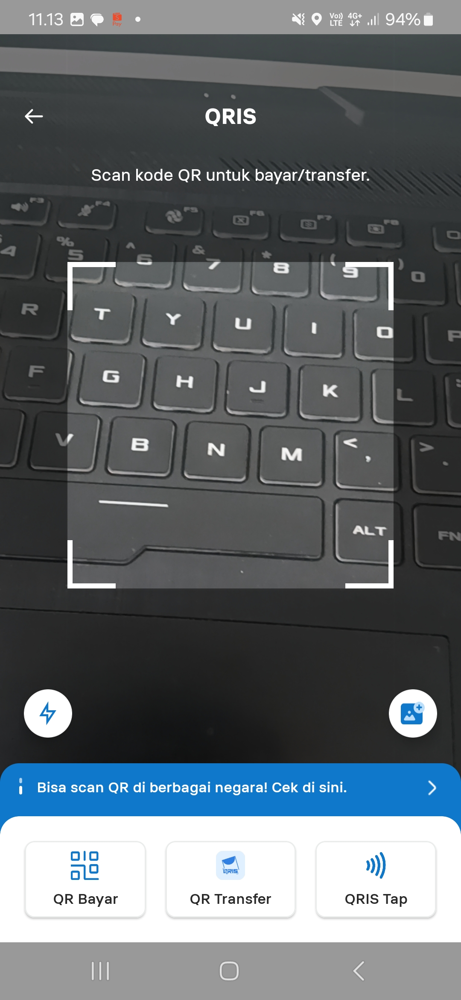
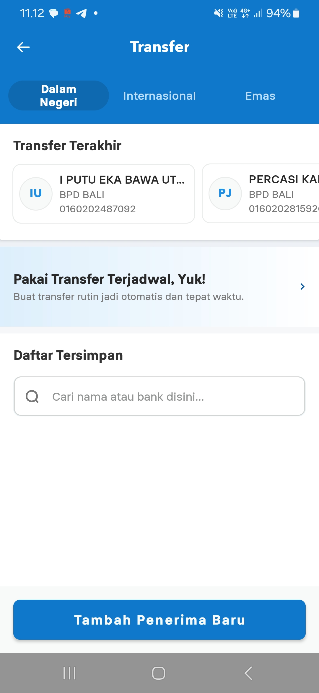
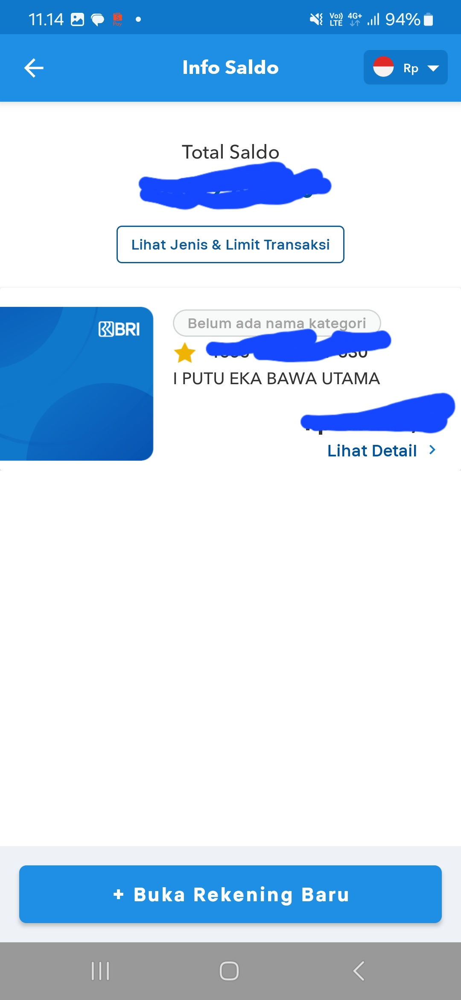

# Analisis Aplikasi Mobile BRImo

## 1. Masalah yang Diselesaikan dan Pengguna Utama

BRImo merupakan aplikasi mobile banking dari Bank BRI yang membantu pengguna melakukan berbagai aktivitas perbankan melalui smartphone tanpa harus datang langsung ke ATM atau kantor bank. Pengguna dapat melakukan transaksi seperti mengecek saldo, transfer, pembayaran, dan pembelian melalui satu aplikasi.

Pengguna utama BRImo adalah nasabah Bank BRI yang membutuhkan layanan perbankan secara praktis melalui perangkat mobile.

## 2. Tiga Fitur Utama dan Manfaat

### 1. Transfer
Digunakan untuk mengirim uang ke rekening tujuan. Fitur ini memudahkan pengguna melakukan transaksi tanpa harus pergi ke ATM.

### 2. QRIS
Digunakan untuk melakukan pembayaran dengan memindai kode QRIS menggunakan kamera smartphone. Pengguna cukup memilih menu QRIS, melakukan scan, memasukkan nominal, kemudian melakukan konfirmasi pembayaran.

### 3. Cek Saldo dan Mutasi
Digunakan untuk melihat saldo rekening dan riwayat transaksi. Fitur ini membantu pengguna mengetahui kondisi rekening dan transaksi yang telah dilakukan.

## 3. Alur Pembayaran Menggunakan QRIS

1. Pengguna membuka aplikasi BRImo.
2. Pengguna memilih menu QRIS.
3. Kamera smartphone digunakan untuk memindai kode QRIS.
4. Pengguna memasukkan atau memeriksa nominal pembayaran.
5. Pengguna memeriksa detail transaksi.
6. Pengguna melakukan konfirmasi pembayaran.
7. Transaksi berhasil dan status pembayaran ditampilkan pada aplikasi.

## 4. Alasan Menggunakan Mobile

BRImo membutuhkan aplikasi mobile karena layanan perbankan perlu dapat diakses dengan cepat dan praktis dari berbagai tempat. Smartphone juga memiliki fitur yang dapat mendukung layanan perbankan, seperti kamera untuk QRIS dan verifikasi wajah.

Jika hanya menggunakan website, layanan perbankan memang tetap dapat dilakukan, tetapi aplikasi mobile lebih praktis karena dapat diakses langsung melalui smartphone dan dapat memanfaatkan fitur perangkat. BRImo sendiri menyediakan berbagai layanan perbankan dalam satu aplikasi.

## 5. Integrasi Perangkat

BRImo memanfaatkan beberapa fitur perangkat mobile. Salah satunya adalah kamera, yang digunakan ketika pengguna melakukan pembayaran menggunakan QRIS. Kamera juga digunakan dalam proses verifikasi identitas seperti foto e-KTP dan verifikasi wajah ketika melakukan pendaftaran.

Selain itu, aplikasi juga menggunakan notifikasi untuk memberikan informasi terkait aktivitas atau transaksi pengguna.

## 6. Usulan Perbaikan

Salah satu kendala yang menurut saya dapat dialami pengguna adalah banyaknya fitur dan menu yang tersedia, sehingga pengguna baru mungkin membutuhkan waktu untuk menemukan fitur tertentu.

Pengguna yang sudah berumur atau lansia terkadang dapat mengalami kesulitan dalam mencari menu yang diperlukan. Usulan perbaikannya adalah membuat pengelompokan menu yang lebih sederhana dan menyediakan fitur pencarian menu yang mudah ditemukan.

Dengan begitu, pengguna dapat menemukan layanan yang dibutuhkan dengan lebih cepat tanpa harus membuka banyak menu.

